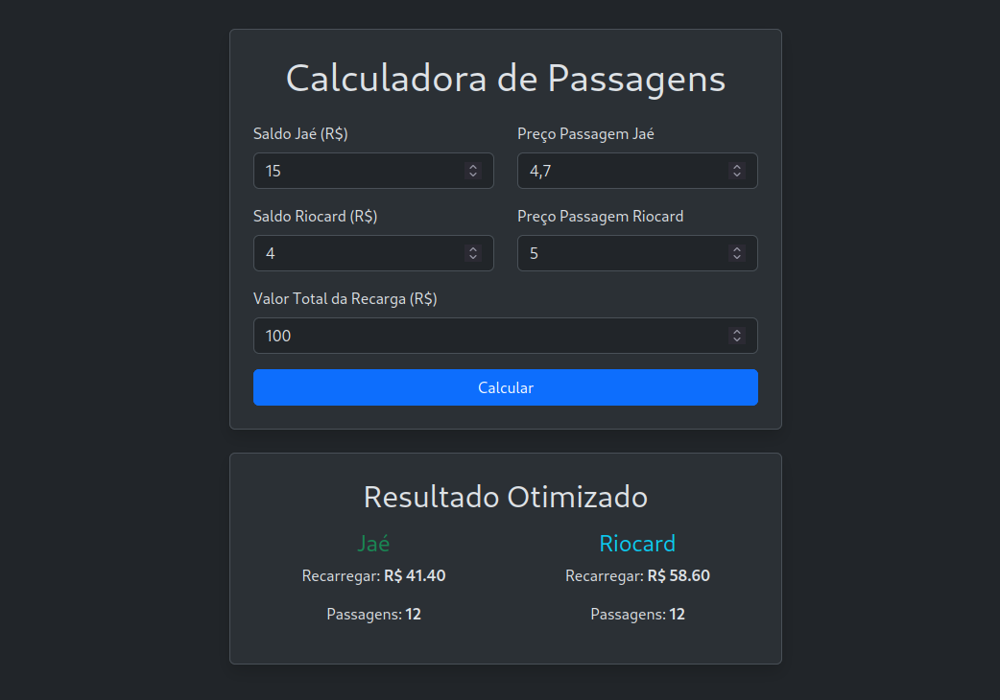

# Calculadora de Recarga de Cartões de Transporte



## 🎯 Sobre o Projeto

A **Calculadora de Recarga** é uma aplicação web inteligente projetada para otimizar o uso de dois cartões de transporte. Com base nos saldos, no valor da recarga e nas tarifas, a ferramenta calcula a distribuição ideal para atingir um **equilíbrio de passagens personalizável**, permitindo que você decida se prefere um número igual de passagens ou favorecer um dos cartões com uma quantidade específica a mais.

Chega de fazer contas de cabeça ou desperdiçar saldo!

---

## ✨ Funcionalidades

-   **Cálculo Otimizado:** Encontra a melhor distribuição de recarga para atingir seu objetivo.
-   **Diferença Alvo Personalizável:** Defina a diferença exata de passagens que você deseja entre os cartões (ex: 0 para equilíbrio, +2 para favorecer o primeiro, ou -3 para o segundo).
-   **Interface Moderna e Responsiva:** Design limpo que funciona perfeitamente em desktops e celulares.
-   **Tarifas Flexíveis:** Permite inserir os valores exatos das tarifas para cada cartão.
-   **Persistência de Dados:** O formulário memoriza os últimos valores inseridos para agilizar o uso.

---

## 💡 Lógica de Otimização

Para garantir um resultado preciso e com alta performance, a calculadora implementa um algoritmo otimizado:

1.  **Iteração por Passagens (Eficiente):** Para encontrar a solução ideal, o algoritmo itera de forma inteligente sobre o número de passagens possíveis para o primeiro cartão. Essa abordagem garante alta performance.

2.  **Cálculo do "Custo":** Para cada quantidade de passagens do primeiro cartão (`n1`), o algoritmo calcula:
    -   A recarga mínima necessária para atingir `n1`.
    -   A recarga restante para o segundo cartão.
    -   O número de passagens resultante para o segundo cartão (`n2`).

3.  **Busca pelo Menor Custo:** O objetivo é encontrar a combinação que minimiza o **"custo"**, definido como a distância entre a diferença de passagens real (`n1 - n2`) e a **diferença desejada** pelo usuário.

4.  **Seleção da Melhor Opção:** A solução com o menor custo é selecionada como a ideal, garantindo o resultado que mais se aproxima do seu objetivo.

5.  **Exatidão com `Decimal`:** Todas as operações financeiras utilizam o tipo `Decimal` do Python, eliminando os erros de arredondamento de tipos de ponto flutuante e garantindo que o resultado seja matematicamente exato.

---

## 🚀 Como Executar

Este projeto é totalmente containerizado com Docker, tornando a execução simples e rápida.

### Pré-requisitos

-   [Docker](https://www.docker.com/get-started)
-   [Docker Compose](https://docs.docker.com/compose/install/)

### Passos

1.  **Clone este repositório:**
    ```bash
    git clone https://github.com/rolim520/Calculadora-Cartoes.git
    ```

2.  **Navegue até o diretório do projeto:**
    ```bash
    cd Calculadora-Cartoes
    ```

3.  **Inicie a aplicação com Docker Compose:**
    ```bash
    docker compose up -d
    ```

4.  **Acesse a aplicação:**
    Abra seu navegador e acesse [http://localhost:5000](http://localhost:5000).

Pronto! A calculadora já está funcionando.

---

## 🛠️ Tecnologias Utilizadas

-   **Backend:**
    -   [Python](https://www.python.org/)
    -   [Flask](https://flask.palletsprojects.com/)
-   **Frontend:**
    -   HTML5
    -   CSS3
    -   [Bootstrap 5](https://getbootstrap.com/)
-   **Containerização:**
    -   [Docker](https://www.docker.com/)

